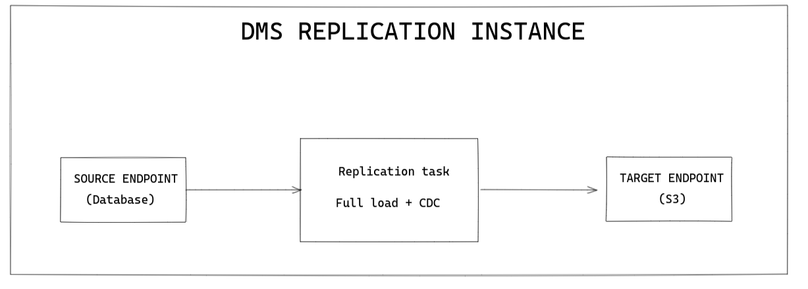

# Database Migration Service

## Introduction and project overview

This project was developed to create an infrastructure as a code (IaC) for a database migraton. All the infrastructure was built using AWS cloudformation. After applying the infrastructure it is possible to start a database migration task, that would copy the data from a Postgrees DB and save it to an S3 bucket in parquet format.
The database migration task runs every two minutes and uses a full load and CDC method strategy for the loading.

##### Infrastructure:
* S3 bucket: where the parquet files are stored
* RDS instance: a postgres instance that the data will be copied from. To populate the database the script "insert.py" should be executed. It is tresponsible for connecting to the instance and the insert random data to the database.
* DMS instance: a database migration service that will be used to copy the data from the RDS instance to the S3 bucket.

##### Possible scenarios:
We discussed discussed three scenarios that could be done to perform the database duplication.
* Scenario 1:
  Get the data from the RDS instance and just create a simple copy of the data to another RDS instance.
  In real projects this scenario would work for small amount of that and few people using tools for querying the database replica.
  Has the advantage of being cheap, but becomes as the amount of data grows it is harder to scale (vertical scaling) and the queries are too slow.


* Scenario 2:
  Get the data from the RDS instance and create a script to ETL the data to a Data Warehouse, like an instance of AWS Redshift.
  In real projects this scenario would work for large amount of data and many people using tools for querying the data warehouse.
  It is fast, horizontally scalable but can be expensive. Using AWS Redshift we have storage and computer processing tied together at the same resource.


* Scenario 3:
  Get the data from the RDS instance and using a DMS task save the parquet generated files in S3. Storing files in S3 is cheap. These files are flexible and can be read and analysed by different tools as Spark, AWS Athena, AWS Redshift Spectrum. This uncouple the storage (S3) and computing processing (tools mentioned before), making it possible to optimize resources/costs.




For this project we have chosen Scenario 3. The amount of data we have does not justify it, but we can use it for educational pourposes.

Database migration can be done in three different ways:
* Full load: every time the tasks runs it copies all the data from the database.
* Change Data Capture (CDC): every time the tasks runs it copies all the data that is new after the last time the task ran. It is possible because the RDS keeps an log of all the changes.
* Full load + CDC: it combines the two previous methods. First it copies all the data and then it would copy only the changes.


## Tecnologies and tools used
* Language: Python 3.8
* AWS Services: RDS, DMS, S3, IAM
* Database: Postgrees


## How to run

Install requirements:
```
pip install -r requirements.txt
```

Upload the file "infra.yaml" to AWS at cloudformation section.
Wait for the stack to be created. It may take a while.

Cofigure a .env file with the following variables:
```
USER=<your_database_user>
PASSWORD=<your_database_password>
HOST=<your_database_hosss_address>
```

Insert the data to the database:
```
python3 insert.py
```
This will insert random data to the RDS instance that we created.
Start the database migration task at AWS DMS section.


Verify the table migration statistics:

Here, for example, we first inserted 28 rows (full load) and as the insert.py script keeps inserting records to the RDS instance more rows are copied usig CDC.

Verifying the S3 bucket we can see the parquet files that represents the data migrated. In this example we first have a full load file "LOAD00000001.parquet" and then the other files that represents files originated from the CDC operation.


